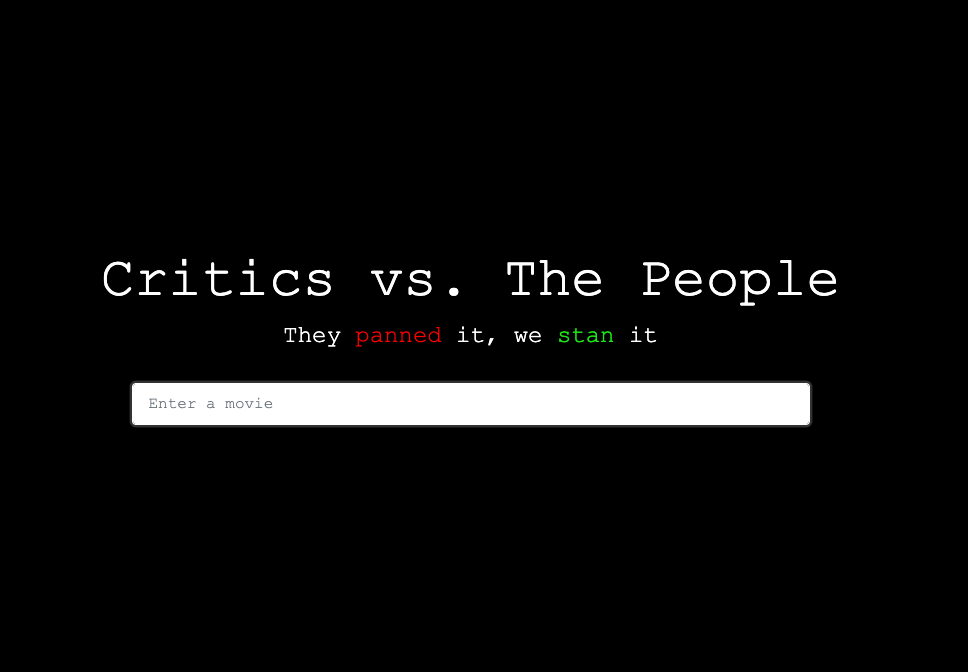

<!-- Improved compatibility of back to top link: See: https://github.com/othneildrew/Best-README-Template/pull/73 -->
<a name="readme-top"></a>
<!--
*** Thanks for checking out the Best-README-Template. If you have a suggestion
*** that would make this better, please fork the repo and create a pull request
*** or simply open an issue with the tag "enhancement".
*** Don't forget to give the project a star!
*** Thanks again! Now go create something AMAZING! :D
-->


<!-- PROJECT SHIELDS -->
<!--
*** I'm using markdown "reference style" links for readability.
*** Reference links are enclosed in brackets [ ] instead of parentheses ( ).
*** See the bottom of this document for the declaration of the reference variables
*** for contributors-url, forks-url, etc. This is an optional, concise syntax you may use.
*** https://www.markdownguide.org/basic-syntax/#reference-style-links
-->
[![MIT License][license-shield]][license-url]

<!-- PROJECT LOGO -->
<br />
<div align="center">
  <a href="https://github.com/jackmulligan-ire/critics-versus-people">
    
  </a>

<h3 align="center">Critics vs. The People</h3>

  <p align="center">
    Compare critic and audience reviews for all your favourite movies!
    <br />
    <a href="https://jackmulligan-ire.github.io/critics-versus-people/">Try it Out!</a>
    ·
    <a href="https://github.com/jackmulligan-ire/critics-versus-people/issues">Report Bug or Request a Feature</a>
  </p>
</div>


<!-- TABLE OF CONTENTS -->
<details>
  <summary>Table of Contents</summary>
  <ol>
    <li>
      <a href="#about-the-project">About The Project</a>
      <ul>
        <li><a href="#built-with">Built With</a></li>
      </ul>
    </li>
    <li>
      <a href="#getting-started">Getting Started</a>
      <ul>
        <li><a href="#prerequisites">Prerequisites</a></li>
        <li><a href="#installation">Installation</a></li>
      </ul>
    </li>
    <li><a href="#usage">Usage</a></li>
    <li><a href="#roadmap">Roadmap</a></li>
    <li><a href="#contributing">Contributing</a></li>
    <li><a href="#license">License</a></li>
    <li><a href="#contact">Contact</a></li>
    <li><a href="#acknowledgments">Acknowledgments</a></li>
  </ol>
</details>


<!-- ABOUT THE PROJECT -->
## About The Project

<p align="center">
  
</p>

A web application that compares the aggregate score given by viewers and reviewers for a particular movie on the Open Movie Database.

The application delivers a memorable user experience on top of a simple concept, with the application aiming to maximise time spent on site. It's designed to be immersive, with neon colours presented against a pitch-black background. It also has a sense of humour, with load spinners and the initial page view accompanied by randomly generated phrases. I kept the shipped features as minimal as possible to provide an excellent experience on smaller screens.

Aside from using the project to learn React, this was also the first project I developed using TDD, using jest as well as React Testing Library.

### Built With

[![JavaScript][JavaScript]][JavaScript-url] 
[![React][React.js]][React-url] 
[![Bootstrap][Bootstrap.com]][Bootstrap-url] 
[![npm][npm]][npm-url] 
[![Jest][Jest]][Jest-url] 
[![React Testing Library][React Testing Library]][react-testing-library-url]

<p align="right">(<a href="#readme-top">back to top</a>)</p>

<!-- GETTING STARTED -->
## Getting Started

This is an example of how you may give instructions on setting up your project locally.
To get a local copy up and running follow these simple example steps.

### Prerequisites

This is an example of how to list things you need to use the software and how to install them.
* npm
  ```sh
  npm install npm@latest -g
  ```

### Installation

1. Get a free API Key at [https://example.com](https://example.com)
2. Clone the repo
   ```sh
   git clone https://github.com/jackmulligan-ire/critics-versus-people.git
   ```
3. Install NPM packages
   ```sh
   npm install
   ```
4. Enter your API in `config.js`
   ```js
   const API_KEY = 'ENTER YOUR API';
   ```

<p align="right">(<a href="#readme-top">back to top</a>)</p>

<!-- USAGE EXAMPLES -->
## Usage

### Movie Ratings
The following information is provided for each movie: its Metacritic (“Critics”) and IMDB rating (“The People”), as well as a short description and its poster (if available). An IMDB link is also provided, with this opening up a new tab to not break the user’s visit on the site. Mobile-first design motivated the final feature selection, with features kept at a minimum to provide for a consistent experience cross-platform.

### Initial Screen


An initial screen hints at the concept of the website, with a motto pitting critic and viewer opinion against one another. Many of these phrases are available, with a random number generator determining which one is shown on each page refresh.

### Responsiveness

The application is made responsive through a mixture of container Bootstrap’s default logic and Sass files that set custom breakpoints for very small and very large screen sizes. 

### Load Spinner

All movie data is sourced from the Open Movie Database API, so it was necessary to include some form of load spinner. To prevent the immersion in the app from becoming broken, a phrase is also placed under the spinner. Multiple of these phrases are available, with one being selected at random on each call to the API. A timeout of 1 second is included on the get request to the API, so that the load phrase remains visible just long enough to be read by the user.

### Error Handling

Two sources of error are accounted for: connection errors and gibberish search terms. An error screen is in-place for both scenarios, with a search bar in the site’s navbar allowing the user’s experience on the site to continue.

<p align="right">(<a href="#readme-top">back to top</a>)</p>

<!-- ROADMAP -->
## Roadmap

- [ ] Add config.js file for OMDB API Key.
- [ ] Convert codebase from JavaScript to TypeScript.
- [ ] Increase testing coverage to mock the OMDb API.
- [ ] Second page showing movies with biggest differences in their reviews.
- [ ] Convert codebase to from React Class Components to Functional Components (Hooks).

<p align="right">(<a href="#readme-top">back to top</a>)</p>

<!-- CONTRIBUTING -->
## Contributing

If you have a suggestion to improve Critics vs. The People, please fork the repo and create a pull request. You can also simply open an issue with the tag "enhancement".
Don't forget to give the project a star! Thanks again!

1. Fork the Project
2. Create your Feature Branch (`git checkout -b feature/AmazingFeature`)
3. Commit your Changes (`git commit -m 'Add some AmazingFeature'`)
4. Push to the Branch (`git push origin feature/AmazingFeature`)
5. Open a Pull Request

<p align="right">(<a href="#readme-top">back to top</a>)</p>

<!-- LICENSE -->
## License

Distributed under the MIT License. See `LICENSE.txt` for more information.

<p align="right">(<a href="#readme-top">back to top</a>)</p>

<!-- CONTACT -->
## Contact

Jack Mulligan - [LinkedIn](https://www.linkedin.com/in/jack-mulligan/e) - [Email](mailto:mulligja1@gmail.com)

Project Link: [https://github.com/jackmulligan-ire/critics-versus-people](https://github.com/jackmulligan-ire/critics-versus-people)

<p align="right">(<a href="#readme-top">back to top</a>)</p>

<!-- ACKNOWLEDGMENTS -->
## Acknowledgments

* Thank you to [The Odin Project](https://www.theodinproject.com/) for their fantastic resources on [learning React](https://www.theodinproject.com/paths/full-stack-javascript/courses/javascript#react-js) and [JavaScript testing](https://www.theodinproject.com/paths/full-stack-javascript/courses/javascript#testing-javascript).

<p align="right">(<a href="#readme-top">back to top</a>)</p>

<!-- MARKDOWN LINKS & IMAGES -->
<!-- https://www.markdownguide.org/basic-syntax/#reference-style-links -->
[license-shield]: https://img.shields.io/github/license/jackmulligan-ire/critics-versus-people.svg?style=for-the-badge
[license-url]: https://github.com/jackmulligan-ire/critics-versus-people/blob/main/license.txt
[React.js]: https://img.shields.io/badge/React-20232A?style=for-the-badge&logo=react&logoColor=61DAFB
[React-url]: https://reactjs.org/
[Bootstrap.com]: https://img.shields.io/badge/Bootstrap-563D7C?style=for-the-badge&logo=bootstrap&logoColor=white
[Bootstrap-url]: https://getbootstrap.com
[JavaScript]: https://img.shields.io/badge/JavaScript-323330?style=for-the-badge&logo=javascript&logoColor=F7DF1E
[JavaScript-url]: https://www.javascript.com/
[npm]: https://img.shields.io/badge/NPM-%23000000.svg?style=for-the-badge&logo=npm&logoColor=white
[npm-url]: https://www.npmjs.com/
[jest]: https://img.shields.io/badge/-jest-%23C21325?style=for-the-badge&logo=jest&logoColor=white
[jest-url]: https://jestjs.io/
[React Testing Library]: https://img.shields.io/badge/-Testing%20Library-%23E33332?style=for-the-badge&logo=testing-library&logoColor=white
[react-testing-library-url]: https://testing-library.com/
